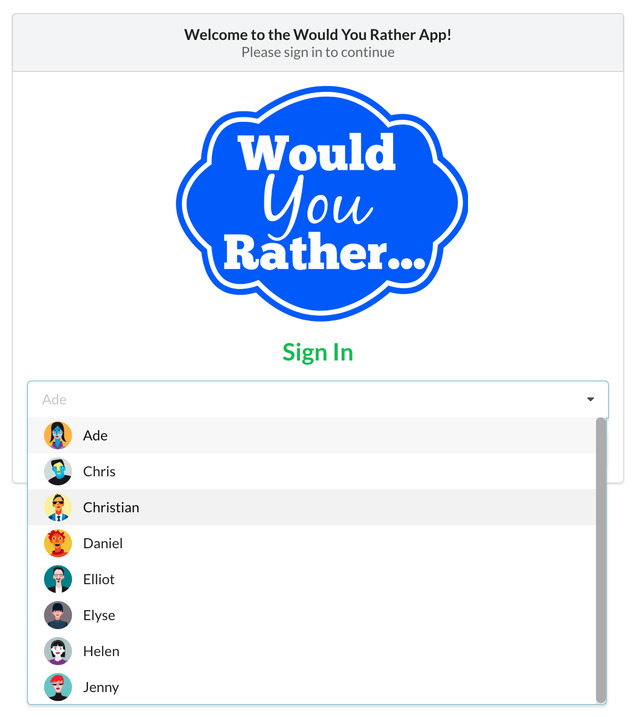

# Would you rather

Would you rather is a simple choice game created using React and Redux. In this game you can choose one of the
two options given to you and view the results of how many other users have answered any one of the two options. There is also an option for user to create their own poll.
A leaderboard is available to view, created based on answered and created questions.


### Prerequisites

To start you need to have node package manager installed in your system.
The packages used in this application is set in package.json.

To install npm you can run following command in your terminal.

```
npm install npm@latest -g
```

### Installing
The application was created with **create-react-app** and requires only few steps to get started.

Besides default packages from create-react-app, the only additional packages installed are,

1. prop-types
2. react
3. react-dom
4. react-redux
5. react-router-dom
6. react-scripts
7. redux
8. redux-thunk
9. semantic-ui-css
10. semantic-ui-react


The application can easily be set and running through following commands

```
npm install
```

And,

```
npm start
```

After you start the project you should see the sign in page as shown in the screen below,


Some of the other available functions are captured in the following screens below,

### User lists
The application is provided with a set of users.



-------------

### Unanswered questions tab
All unanswered questions by user is set on this tab.


-------------

### Answered questions tab
All answered questions by user is set on this tab. If no questions are answered, it will show a message as shown.


-------------

### Answer poll
This is the screen that users gets after selecting a poll to answer.


-------------

### Results
The results of the poll is shown in this screen indicating how many users have voted in this particular
poll and how many of them have chosen specific option including yours, marked with a label.


-------------

### New Poll
User can also create a new poll.


-------------

### Leaderboard
A leaderboard displays top 3 of the users who have highest number of questions answered and created.


-------------

## Author

Prithu Shrestha
